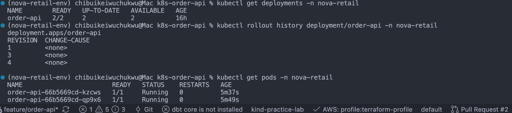
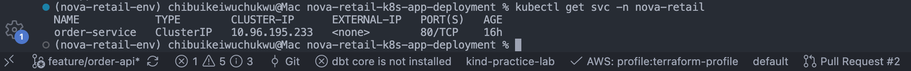

# Kubernetes Order API Platform

## Business Problem

* NovaRetail currently manually run their application(customer order api) as a container on a VM. This creates operational problems such as:
  * A crashed container requires manual intervention.
  * Deployments cause downtime.
  * Application configuration is embedded in the container.
  * The application cannot easily scale.
  * There is no standardized health monitoring.
  * Developers need a stable internal endpoint for accessing the application.

## The Solution

* Migrate Customer Order API to kubernetes so as to help address the above problems.

## Architecture

                User / Tester
                         |
                         |
                  localhost:8080
                         |
                         v
                +----------------+
                |    Service            |
                | order-service     |
                |   ClusterIP          |
                +-------+--------+
                        |
                  label selector
                  app: order-api
                        |
            +-----------+-----------+
            |                                        |
            v                                       v
     +-------------+         +-------------+
     |    Pod 1          |              |    Pod 2     |
     |  order-api     |               |  order-api  |
     +-------------+         +-------------+
            \                                      /
             \                                   /
              +-------------------+
                       |
                 Deployment
                 replicas: 2
                       |
                ConfigMap/Secret

## Technologies

- Kubernetes
- kind
- Docker
- FastAPI
- Python

## Kubernetes Resources

- Namespace
- Deployment
- ReplicaSet
- Pods
- ClusterIP Service
- ConfigMap
- Secret

## Delivery:

Built a containerized API and deployed it to a multi-node Kubernetes environment; managed configuration with ConfigMaps and Secrets; exposed workloads through Kubernetes Services; configured resource requests/limits and health probes; observed Kubernetes reconciliation and self-healing; performed rolling application updates; diagnosed a failed deployment; and restored service using Deployment rollback.

## Application Deployment

## Service Discovery

## Health Checks

## Resource Management

## Rolling Update Test

## Rollback Test

## Troubleshooting
