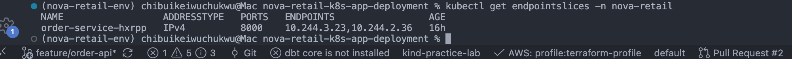
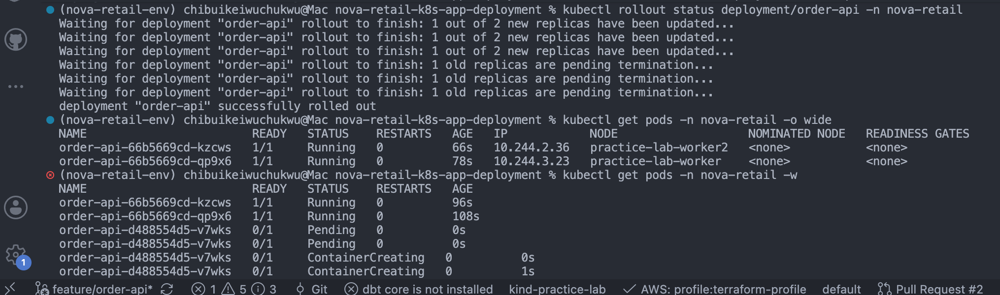
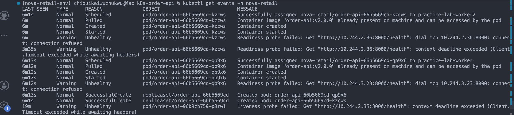

# Kubernetes Order API Platform

## Business Problem

# Milestone 1

* NovaRetail currently manually run their application(customer order api) as a container on a VM. This creates operational problems such as:
  * A crashed container requires manual intervention.
  * Deployments cause downtime.
  * Application configuration is embedded in the container.
  * The application cannot easily scale.
  * There is no standardized health monitoring.
  * Developers need a stable internal endpoint for accessing the application.

## The Solution

* Migrate Customer Order API to kubernetes so as to help address the above problems.

## Architecture

[docs](./docs/)

## Technologies

- Kubernetes
- kind
- Docker
- FastAPI
- Python

## Kubernetes Resources

- Namespace
- Deployment
- ReplicaSet
- Pods
- ClusterIP Service
- ConfigMap
- Secret

## Delivery:

* Built a containerized API and deployed it to a multi-node Kubernetes environment; managed configuration with ConfigMaps and Secrets; exposed workloads through Kubernetes Services; configured resource requests/limits and health probes; observed Kubernetes reconciliation and self-healing; performed rolling application updates; diagnosed a failed deployment; and restored service using Deployment rollback.

## Application Deployment

## Service Discovery

## Service endpointslices

## Rolling Update Test

## Troubleshooting

# Milestone 2:

* Users should access the application through an HTTP endpoint.
* Some application data needs persistent storage.
* The application should automatically scale when demand increases.
* Containers should operate with safer security settings.
* Engineers need better operational visibility.
* The application should survive common infrastructure failures.
* Workloads should be distributed across worker nodes where possible.
